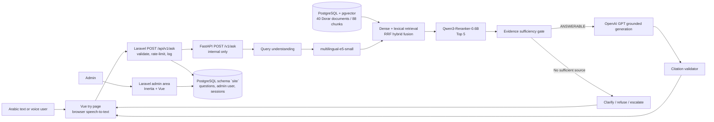

# Architecture

- **Website (`apps/site`):** Laravel 13 with Inertia and Vue 3, Arabic RTL, light and dark themes. Serves the visitor pages (home, try, encyclopedia) and the admin area. Visitors use it without an account; voice questions are transcribed in the browser and sent as text. It owns the public API, validation, rate limiting, the anonymous question log, visitor feedback, the review queue and the dashboards. It forwards each question to the AI service over the internal network with a shared `X-Internal-Token`, and stores the question together with the returned state. If the AI service is unreachable or errors, the question is stored as `FAILED` and the caller gets `503`/`502` instead of an answer.
- **AI service (`apps/api`):** FastAPI constructs the real PostgreSQL repository, E5 embedder, Qwen reranker, OpenAI generator, evidence gate, and citation validator.
- **Corpus:** normalized Dorar documents preserve canonical URL, source identity, content hash, and original text. Structure-aware chunking persists stable chunk IDs.
- **Retrieval:** E5 query vectors search pgvector; PostgreSQL full-text search supplies lexical candidates. Reciprocal-rank fusion combines both lists.
- **Reranking:** Qwen3-Reranker-0.6B scores the five strongest hybrid candidates on CPU.
- **Safety:** the gate routes to `ANSWERABLE`, `NEEDS_CLARIFICATION`, `INSUFFICIENT_EVIDENCE`, `COMPLEX_CASE`, `CONFLICTING_EVIDENCE`, or `OUT_OF_SCOPE`.
- **Generation:** GPT receives only selected evidence and returns structured output with cited chunk IDs.
- **Citation validation:** cited chunk IDs must be present in final retrieved evidence. An answerable response without valid citations is rejected.
- **Traceability:** real browser requests append to `artifacts/generation/answers.jsonl` and overwrite `latest_pipeline_trace.json` with retrieved scores, reranker scores, final evidence, generation, and validation.
- **Voice:** mock/experimental and outside the verified text architecture.

## Service boundaries

| Service | Path | Owns | Exposed to |
|---|---|---|---|
| `site` | `apps/site` | Visitor pages, public API, question log, reviews, admin area | Browser, port 8080 |
| `ai` | `apps/api` | Retrieval, reranking, evidence gate, generation | `site` only (loopback port 8000 for `/health` and `/docs`) |
| `postgres` | `infra/schema.sql` | Schema `public`: knowledge base. Schema `site`: website data | Internal |

Each side owns its tables. The AI service applies `infra/schema.sql` and builds the index; Laravel migrations manage everything in the `site` schema. Neither writes to the other's tables.

The response body of `POST /api/v1/ask` has the same fields as the AI service's `AnswerResponse`, plus the stored question `id`.

The AI service also reports diagnostics that only the admin area uses: each citation's path in the encyclopedia, the passages it considered with their reranker scores, the evidence gate's reasons, and the generation model's name. `GET /v1/info` returns the model names and the real index size. None of this changes retrieval, the gate, or the answer.
