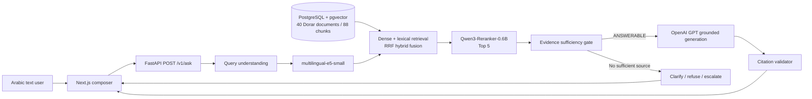

# Architecture

- **Frontend:** Next.js/React Arabic RTL interface posts the user's text question to the same production API path used by runtime verification.
- **API:** FastAPI constructs the real PostgreSQL repository, E5 embedder, Qwen reranker, OpenAI generator, evidence gate, and citation validator.
- **Corpus:** normalized Dorar documents preserve canonical URL, source identity, content hash, and original text. Structure-aware chunking persists stable chunk IDs.
- **Retrieval:** E5 query vectors search pgvector; PostgreSQL full-text search supplies lexical candidates. Reciprocal-rank fusion combines both lists.
- **Reranking:** Qwen3-Reranker-0.6B scores the five strongest hybrid candidates on CPU.
- **Safety:** the gate routes to `ANSWERABLE`, `NEEDS_CLARIFICATION`, `INSUFFICIENT_EVIDENCE`, `COMPLEX_CASE`, `CONFLICTING_EVIDENCE`, or `OUT_OF_SCOPE`.
- **Generation:** GPT receives only selected evidence and returns structured output with cited chunk IDs.
- **Citation validation:** cited chunk IDs must be present in final retrieved evidence. An answerable response without valid citations is rejected.
- **Traceability:** real browser requests append to `artifacts/generation/answers.jsonl` and overwrite `latest_pipeline_trace.json` with retrieved scores, reranker scores, final evidence, generation, and validation.
- **Voice:** mock/experimental and outside the verified text architecture.
