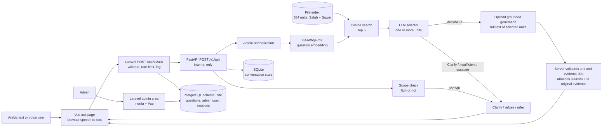

# Architecture

- **Website (`apps/site`):** Laravel 13 with Inertia and Vue 3, Arabic RTL, light and dark themes. Serves the visitor pages (home, ask, encyclopedia, contact) and the admin area. Visitors use it without an account; voice questions are transcribed in the browser and sent as text. It owns the public API, validation, rate limiting, the anonymous question log, visitor feedback, the review queue and the dashboards. It forwards each question to the AI service over the internal network with a shared `X-Internal-Token`, and stores the question together with the returned state. If the AI service is unreachable or errors, the question is stored as `FAILED` and the caller gets `503`/`502` instead of an answer.
- **AI service (`apps/api`):** FastAPI builds `FinalRagService` over the committed production index, with an OpenAI client for selection and generation and a SQLite conversation store.
- **Index:** 584 ruling units from the Salah and Sawm books of the Dorar Fiqh Encyclopedia. Each unit keeps its original title, path, ruling, attributions, consensus statements and evidence items with their source URL. One BGE-M3 vector per unit, built from the cleaned title and ruling.
- **Retrieval:** the question is normalized, embedded with BGE-M3 and compared with every unit by cosine similarity; the top five go on. There is no lexical search and no reranker: the benchmark measured a reranker and found no gain.
- **Selection:** an LLM reads the five candidates (title, ruling, short path, attributions, evidence counts) and selects the units that answer the question, or returns clarify, insufficient evidence or escalate.
- **Generation:** the model receives the full original content of the selected units only and returns structured output: the answer and the IDs of the evidence it relied on.
- **Validation:** every unit ID and evidence ID in the output must belong to what was selected, otherwise the response becomes `INSUFFICIENT_EVIDENCE`. Citations, URLs and evidence text are attached by the server from the stored record.
- **States:** `ANSWERABLE`, `NEEDS_CLARIFICATION`, `INSUFFICIENT_EVIDENCE`, `COMPLEX_CASE`, and `OUT_OF_SCOPE` from a scope check that runs alongside retrieval and only relabels a refusal.
- **Clarification:** each response carries a `conversation_id`. When the state is `NEEDS_CLARIFICATION`, the next message with that ID is combined with the original question on the server and goes through the same pipeline.
- **Voice:** the visitor's browser transcribes speech to text; the AI service's own speech endpoints are disabled.

## Service boundaries

| Service | Path | Owns | Exposed to |
|---|---|---|---|
| `site` | `apps/site` | Visitor pages, public API, question log, reviews, admin area | Browser, port 8080 |
| `ai` | `apps/api` | Retrieval, selection, generation, conversation state | `site` only (loopback port 8000 for `/health` and `/docs`) |
| `postgres` | Laravel migrations | Schema `site`: website data | Internal |

Each side owns its data. The AI service reads the file index and keeps conversation state in SQLite; Laravel migrations manage everything in the `site` schema.

The response body of `POST /api/v1/ask` has the same fields as the AI service's `AnswerResponse`, plus the stored question `id`.

The AI service also reports diagnostics that only the admin area uses: each citation's path in the encyclopedia, the units it considered with their similarity scores, the selector and generation status, and the generation model's name. `GET /v1/info` returns the model names and the real index size. None of this changes retrieval, selection, or the answer.

## Hosted demo

The public demo runs the site and the AI service in one container (`deploy/render/Dockerfile`, `render.yaml`) with an external PostgreSQL. To fit a small free instance it embeds the question with the same BGE-M3 model hosted on Cloudflare Workers AI (`QUERY_EMBEDDING_BACKEND=cloudflare`); the index and everything after retrieval are unchanged.
