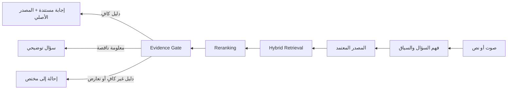
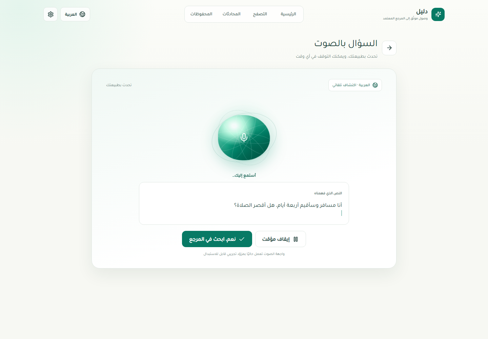
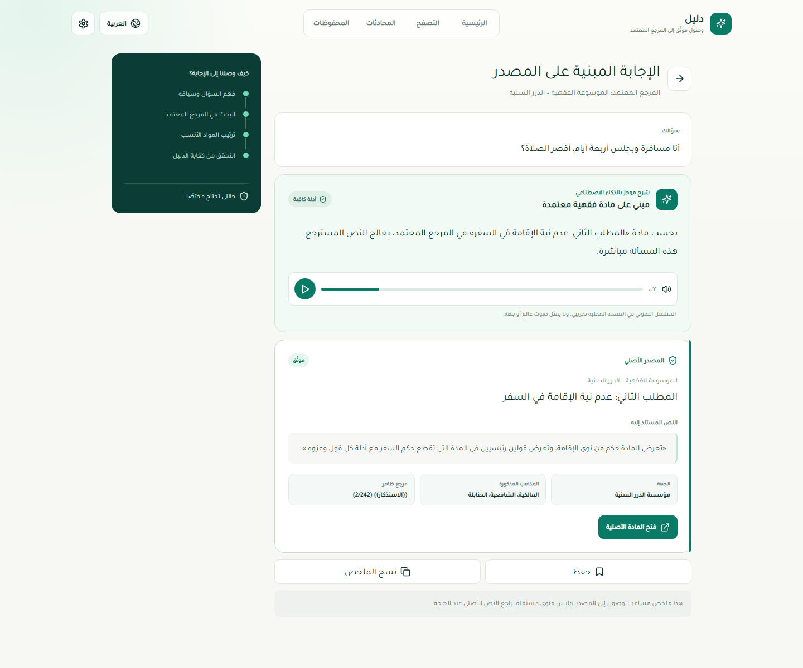
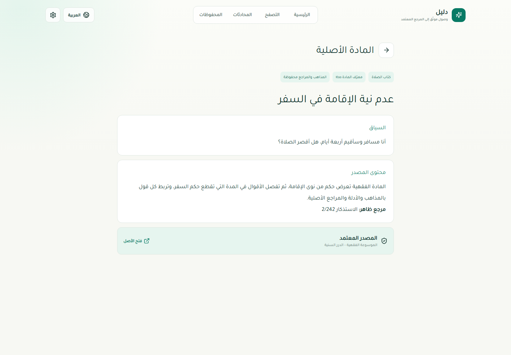

# دليل | Daleel AI

**دليل** واجهة عربية متعددة اللغات بالصوت والنص، تساعد المستخدم على الوصول إلى المعرفة الشرعية من المراجع المعتمدة مع إبقاء المادة الأصلية وهوية المصدر ظاهرتين. النظام لا يصدر فتوى مستقلة: لا يقدم إجابة قطعية من دون دليل مسترجع، ويطلب توضيحًا أو يحيل إلى مختص عندما لا تكفي المادة المتاحة.

**Daleel AI** is a multilingual voice and text interface for accessing grounded Islamic knowledge from approved references. It does not independently issue religious rulings. Every definitive answer requires retrieved evidence, preserves the original source, and falls back to clarification or specialist referral when evidence is insufficient.

> Hackathon track: **الحوار المعرفي والإجابات الموثوقة**

## المشكلة | Problem

المحتوى الشرعي الموثوق موجود، لكن الوصول إلى المادة المناسبة قد يتطلب معرفة المصطلح الفقهي، وفهم بنية المرجع، وربط تفاصيل سؤال المستخدم بنص متخصص. تزداد هذه الصعوبة مع الأسئلة العامية، والصوت، واللغات المختلفة.

Trusted knowledge exists, but users may not know the formal terminology or the structure of the source. Informal phrasing, voice interaction, multilingual questions, and missing context create additional friction.

## الحل | Solution

يدخل المستخدم سؤاله كتابة أو صوتًا. يحلل النظام اللغة والسياق، يبحث داخل مجموعة المصدر المحددة، يرتب الأدلة، ثم يمرر النتيجة عبر **Evidence Gate** قبل توليد شرح موجز مرتبط بالمصدر.



## تجربة المنتج | Product experience

| السؤال بالصوت | الإجابة الموثقة | المصدر الأصلي |
|---|---|---|
|  |  |  |

لقطات إضافية: [الرئيسية](artifacts/screenshots/official/01-home.png)، [التصفح](artifacts/screenshots/official/06-browse.png)، [طلب التوضيح](artifacts/screenshots/official/07-clarification.png)، [الإحالة](artifacts/screenshots/official/08-escalation.png).

## المزايا المنفذة | Implemented features

- واجهة عربية RTL متجاوبة، مع إدخال نصي وتجربة صوتية.
- مجموعة افتراضية منفصلة: `OFFICIAL_HACKATHON_REFERENCE`.
- محول حتمي للموسوعة الفقهية في الدرر السنية يحفظ بنية المصدر والبيانات الصريحة.
- استرجاع واعٍ بالمصدر، مع منع الرجوع الصامت إلى مجموعة أخرى.
- حالات قرار واضحة: `ANSWERABLE`، `NEEDS_CLARIFICATION`، `INSUFFICIENT_EVIDENCE`، `COMPLEX_CASE`، `CONFLICTING_EVIDENCE`.
- إظهار الشرح المساعد منفصلًا عن المادة الأصلية والرابط القانوني.
- محول ابن باز محفوظ داخل `BINBAZ_REFERENCE`، ومعطل من المسار الافتراضي للمسابقة.
- اختبارات لوحدة الإدخال، التجزئة، التدقيق، وبوابة الأدلة.

## جاهز للربط لاحقًا | Provider-ready, not production-integrated

هذه القدرات لها واجهات مزود، لكنها تستخدم تنفيذًا تجريبيًا أو حتميًا في النسخة الحالية:

- ASR لتحويل الصوت إلى نص.
- TTS لتحويل الإجابة إلى صوت.
- نماذج Embedding خارجية.
- Reranker خارجي.
- LLM خارجي للتلخيص المقيد بالدليل.
- توسيع اللغات والمراجع الرسمية ضمن مجموعات مستقلة.

لا يدّعي المشروع حاليًا دمج Qwen أو خدمة ASR/TTS إنتاجية أو نموذج خارجي محدد.

## الموثوقية والسلامة | Trust and safety

قاعدة النظام الأساسية: **لا مصدر موثوق = لا إجابة قطعية**.

- لا يعتمد الجواب على المعرفة العامة للنموذج.
- تبقى البيانات الوصفية المفقودة `NULL` بدل تخمينها.
- لا يختار النظام الرأي الراجح من تلقائه.
- لا يدمج أقوال جهات أو مذاهب مختلفة في حكم مصطنع.
- الحالات غير المدعومة أو المعقدة أو المتعارضة تنتقل إلى الإحالة.

## بنية المصدر | Source architecture

```text
SourceAdapter
├── HackathonApprovedSourceAdapter  → OFFICIAL_HACKATHON_REFERENCE
└── IbnBazSourceAdapter             → BINBAZ_REFERENCE (isolated, disabled by default)
```

المصدر المعتمد للنسخة التنافسية هو [الموسوعة الفقهية - الدرر السنية](https://dorar.net/feqhia). لا يحتوي المستودع العام على corpus منسوخ من المرجع؛ ملفات الاختبار تركيبية وتحاكي البنية فقط. راجع [سجل المصادر والتراخيص](docs/sources-and-licenses.md).

## التقنية | Technology stack

- **Web:** Next.js, React, TypeScript
- **API:** FastAPI, Pydantic, SQLAlchemy
- **Data:** PostgreSQL, pgvector schema
- **Retrieval:** lexical/vector-ready retrieval, source-aware reranking, Evidence Gate
- **UI assets:** Lucide icons and real local application screenshots

## هيكل المستودع | Repository structure

```text
apps/web/        Next.js interface
apps/api/        FastAPI, RAG orchestration, adapters, providers, tests
infra/           PostgreSQL + pgvector schema
docs/            source, discovery, and license records
artifacts/       public product screenshots only
```

## التشغيل محليًا | Local installation

### 1. الواجهة

```bash
npm install
npm run dev
```

تعمل الواجهة افتراضيًا على `http://localhost:3000`.

### 2. خدمة API

```bash
cd apps/api
python -m venv .venv
# Windows: .venv\Scripts\activate
# macOS/Linux: source .venv/bin/activate
pip install -e ".[dev]"
uvicorn app.main:app --reload
```

تعمل الخدمة افتراضيًا على `http://localhost:8000`.

### 3. الإعدادات وقاعدة البيانات

انسخ `.env.example` إلى `.env`، واستبدل القيم المؤقتة محليًا. لا تلتزم بملف `.env` في Git.

```bash
docker compose up -d
```

يتطلب Docker Compose تعيين `POSTGRES_PASSWORD` في ملف `.env` المحلي.

### 4. الاختبارات

```bash
cd apps/api
pytest
```

```bash
npm run build
```

## فريق العمل | Team

- **نجود بن إسحاق — AI Engineer**
- **بشرى شودري — Software Engineer**

## الإفصاح | Disclosure

يوثق [سجل المصادر والتراخيص](docs/sources-and-licenses.md) المراجع، الأدوات، المكتبات، التراخيص، والموفرات غير المتصلة. لا تُحفظ مفاتيح أو بيانات اعتماد داخل المستودع.
