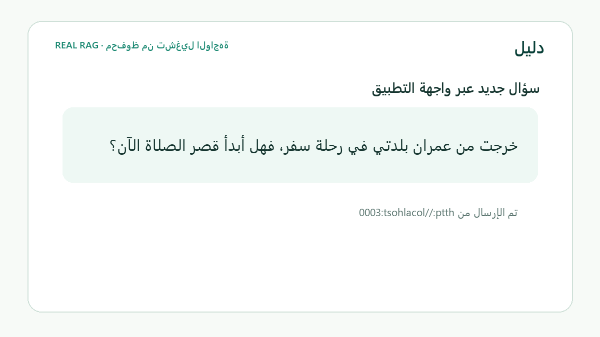

# دليل | Daleel

**سؤال عربي طبيعي → استرجاع هجين من الموسوعة الفقهية للدرر السنية → إجابة GPT موثقة، أو امتناع آمن.**

المسار الرسمي: **الحوار المعرفي والإجابات الموثوقة**



العرض مبني آليًا من آخر تتبع حقيقي لمسار المتصفح؛ السؤال والإجابة ومعرّف المصدر مأخوذة من [`latest_pipeline_trace.json`](artifacts/generation/latest_pipeline_trace.json)، وليست نتيجة mock.

[دليل المحكّم](JUDGING.md) · [التشغيل المفصل](RUNBOOK.md) · [المعمارية](ARCHITECTURE.md) · [القيود](LIMITATIONS.md) · [الادعاءات والأدلة](docs/CLAIM_EVIDENCE_MATRIX.md)

## الغرض

يساعد دليل المستخدم على الوصول إلى مادة فقهية معتمدة بصياغته الطبيعية. لا يولّد جوابًا دينيًا من ذاكرة النموذج: يجب أن يعثر أولًا على دليل كافٍ من المجموعة المعتمدة، ثم يتحقق من أن كل استشهاد يعود إلى المواد المسترجعة. المبدأ الحاكم هو: **لا مصدر = لا إجابة**.

## المسار الفعلي

```text
Dorar documents
  → persisted chunks
  → multilingual-e5-small embeddings (384 dimensions)
  → PostgreSQL + pgvector dense search + PostgreSQL lexical search
  → reciprocal-rank hybrid fusion
  → Qwen3-Reranker-0.6B
  → evidence sufficiency gate
  → OpenAI GPT grounded generation
  → citation validation
  → FastAPI → Next.js UI
```

مسار السؤال النصي أعلاه حقيقي ومشترك بين الواجهة و`POST /v1/ask`. الصوت ما زال تجريبيًا/mock ولا يدخل في تقييم RAG الحقيقي.

## الأدلة القابلة للفحص

| الدليل | القيمة المقاسة | الملف |
|---|---:|---|
| مستندات Dorar | 40 | [`artifacts/corpus/documents.jsonl`](artifacts/corpus/documents.jsonl) |
| المقاطع | 88 | [`artifacts/chunks/chunks.jsonl`](artifacts/chunks/chunks.jsonl) |
| نموذج التضمين | `intfloat/multilingual-e5-small` | [`artifacts/embeddings/manifest.json`](artifacts/embeddings/manifest.json) |
| بُعد التضمين | 384 | [`artifacts/embeddings/manifest.json`](artifacts/embeddings/manifest.json) |
| أسئلة RAG الحقيقية | 10 | [`evaluation/real_rag_questions.jsonl`](evaluation/real_rag_questions.jsonl) |
| نتائج الاسترجاع | 10 تشغيلات | [`artifacts/retrieval/results.jsonl`](artifacts/retrieval/results.jsonl) |
| نتائج Qwen | 10 تشغيلات | [`artifacts/reranking/results.jsonl`](artifacts/reranking/results.jsonl) |
| الإجابات وتحقق الاستشهاد | سجل JSONL | [`artifacts/generation/answers.jsonl`](artifacts/generation/answers.jsonl) |
| تتبع المتصفح الأخير | E5، lexical، fusion، Qwen، GPT، citations | [`artifacts/generation/latest_pipeline_trace.json`](artifacts/generation/latest_pipeline_trace.json) |
| مقاييس الاسترجاع | قيم محسوبة فقط | [`artifacts/evaluation/retrieval_metrics.json`](artifacts/evaluation/retrieval_metrics.json) |
| مقاييس reranker | before/after محسوبة | [`artifacts/evaluation/reranker_metrics.json`](artifacts/evaluation/reranker_metrics.json) |

ملف `chunk_embeddings.npy` محلي وغير مخصص لـGit؛ قاعدة PostgreSQL تُعاد تعبئتها من المستندات/المقاطع وتُنشأ التضمينات محليًا.

## التشغيل المحلي

المتطلبات: Python 3.11+، Node.js 20+، Docker Desktop/Compose، وذاكرة كافية لتشغيل E5 وQwen على CPU. انسخ ملف البيئة ولا تلتزم به في Git:

```powershell
Copy-Item .env.example .env
```

عيّن في `.env` على الأقل:

```dotenv
POSTGRES_PASSWORD=<local-password>
DATABASE_URL=postgresql+psycopg://daleel:<local-password>@localhost:5432/daleel
OPENAI_API_KEY=<your-key>
NEXT_PUBLIC_API_URL=http://localhost:8000
```

ثبّت الاعتماديات مرة واحدة:

```powershell
python -m venv apps/api/.venv-real
apps/api/.venv-real/Scripts/python -m pip install -e ".\apps\api[dev]"
npm ci
```

شغّل كل خدمة في نافذة مستقلة من جذر المستودع:

```powershell
docker compose up -d postgres
apps/api/.venv-real/Scripts/python -m uvicorn app.main:app --app-dir apps/api --host 127.0.0.1 --port 8000
npm run dev
```

افتح `http://localhost:3000`. فحص API: `http://127.0.0.1:8000/health`. تحميل البيانات وقاعدة المعرفة موثق في [RUNBOOK.md](RUNBOOK.md). لا تطبع مفتاح OpenAI ولا تضع `.env` في Git.

## الاختبارات والتقييم

هذه المسارات منفصلة عمدًا:

```powershell
# Unit/safety tests — منطق التطبيق؛ لا تقيس دقة RAG الحقيقية
apps/api/.venv-real/Scripts/python -m pytest apps/api/tests

# Deterministic/offline behavior suite — mocks؛ لا تمثل دقة E5/Qwen/GPT
apps/api/.venv-real/Scripts/python evaluate.py

# REAL retrieval evaluation — PostgreSQL + E5 + lexical + hybrid fusion
$env:PYTHONPATH="apps/api"
apps/api/.venv-real/Scripts/python evaluate_real_rag.py

# REAL Qwen reranking over persisted retrieval candidates
apps/api/.venv-real/Scripts/python rerank_real_rag.py
```

لعرض النتائج افتح [`artifacts/evaluation/results.csv`](artifacts/evaluation/results.csv)، [`retrieval_metrics.json`](artifacts/evaluation/retrieval_metrics.json)، و[`reranker_metrics.json`](artifacts/evaluation/reranker_metrics.json). توليد GPT الحقيقي يحتاج `OPENAI_API_KEY` وقد يستهلك رصيد API؛ آخر النتائج الحقيقية محفوظة بالفعل في `artifacts/generation/`.

## بناء الواجهة

```powershell
npm run build
```

## القيود الحالية

- corpus مضبوط على 40 صفحة Dorar فقهية و88 مقطعًا، وليس الموسوعة كاملة.
- المقاييس على 10 أسئلة فقط؛ هي مؤشرات استرجاع وليست قياسًا للصحة الشرعية.
- Qwen يعمل محليًا على CPU ويعيد ترتيب أعلى خمسة مرشحين من Top-20 المحفوظة؛ قد يكون بطيئًا.
- GPT يتطلب شبكة ومفتاحًا خاصًا؛ بوابة الدليل قد تمتنع حتى عند وجود مادة قريبة.
- العربية هي المسار المجرّب. الصوت وTTS/ASR ليسا جزءًا إنتاجيًا من مسار النص.
- لا يوجد نشر عام أو مصادقة أو rate limiting. راجع [LIMITATIONS.md](LIMITATIONS.md).
- محتوى Dorar له حقوقه الأصلية؛ راجع [سجل المصادر والتراخيص](docs/sources-and-licenses.md) قبل نشر corpus علنًا.

## الفريق

- نجود بن إسحاق — مهندس ذكاء اصطناعي
- بشرى شودري — مهندس برمجيات

## المصادر والتراخيص

السجل الكامل للأدوات والنماذج والخدمات والحقوق في [`docs/sources-and-licenses.md`](docs/sources-and-licenses.md). لا يحتوي المستودع حاليًا على ترخيص مشروع عام؛ لذلك لا تُفترض حقوق إعادة الاستخدام تلقائيًا.
